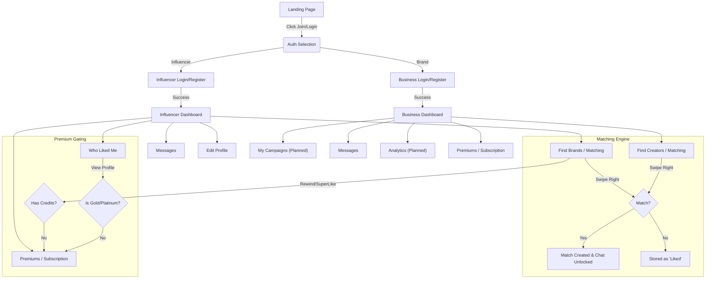
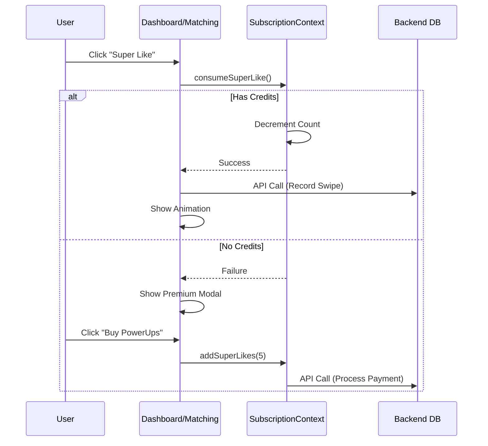

# Ping Application Architecture & Flow

## 1. User User Flow (High Level)

## 2. Backend & Data Connections

### Current State (Frontend-Heavy / Mock Data)
Currently, the application uses **React Context** (`SubscriptionContext`) to manage state locally for the session. Data for matches and profiles is currently served via static JSON arrays (`CREATORS_DATA`, `BRANDS_DATA`) in the page files.

### Backend Requirements (To Be Connected)

#### A. Database Schema (Prisma/SQLite)

**1. User Model**
*   `id`: UUID
*   `email`: String (Unique)
*   `role`: 'INFLUENCER' | 'BUSINESS'
*   `tier`: 'FREE' | 'PLUS' | 'GOLD' | 'PLATINUM'
*   `createdAt`: DateTime

**2. Profile Models**
*   **InfluencerProfile**: `userId`, `name`, `niche`, `instagram`, `bio`, `images[]`, `credits`
*   **BusinessProfile**: `userId`, `companyName`, `website`, `industry`, `logo`, `credits`

**3. Matches & Interactions**
*   **Swipe**: `fromUserId`, `toUserId`, `direction` ('LEFT' | 'RIGHT' | 'SUPERLIKE'), `timestamp`
*   **Match**: `id`, `userA`, `userB`, `createdAt` (Created when two Right Swipes exist)
*   **Consumables**: `userId`, `superLikesCount`, `boostsCount`

### B. API Routes Needed

| Route | Method | Purpose | Connected Component |
| :--- | :--- | :--- | :--- |
| `/api/auth/register` | POST | Create new user & profile | Register Forms |
| `/api/auth/login` | POST | Authenticate & return JWT | Login Pages |
| `/api/user/me` | GET | Get current user details & tier | Dashboards / Context |
| `/api/matching/candidates` | GET | Get potential matches (filtered) | `/dashboard/matching` |
| `/api/matching/swipe` | POST | Record a swipe action | Swipe Cards |
| `/api/subscription/upgrade` | POST | Process payment & update tier | `/dashboard/premiums` |

## 3. Subscription Logic Flow

